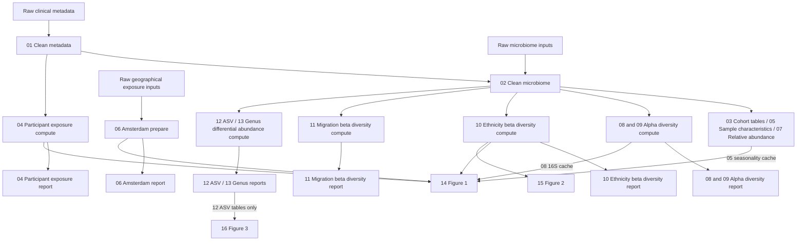

# HELIUS project on oral and gut microbiomes
Interdisciplinary project within the UvA Research Priority Area - Personal Microbiome Health, using HELIUS oral and gut microbiome data

## Data
Two microbiome data types from the HELIUS cohort, processed in parallel:
- **16S rRNA amplicon sequencing** — throat and nose swabs
- **Shotgun metagenomics** — tongue and throat swabs

Raw sequencing output and clinical/metadata are cleaned into `phyloseq`/table objects in `data/processed/` (see `scripts/01_clean_metadata.R` and `scripts/02_clean_microbiome.R`).

### Upstream read processing
`scripts/00_run_vsearch.sh` is a SLURM batch script that runs a Nextflow vsearch pipeline (clustering/rarefaction of raw sequencing reads into ASV tables) on the Snellius HPC cluster, ahead of and separate from the `pixi`-managed steps below. Its output is imported as the raw phyloseq input to `02_clean_microbiome.R`; submit it with `sbatch scripts/00_run_vsearch.sh`.

## Analysis pipeline
Scripts are numbered in **reading order**, grouped by analysis family. They
form a dependency graph, not one sequential chain. Pixi runs the prerequisites
needed for the requested output.

Names follow `number_analysis_sequencing-type_comparison_stage.R`, omitting
parts that do not apply. In the table, `{compute,report}` means two files.

| Script(s) | Purpose | Pixi entry point |
|---|---|---|
| `01_clean_metadata.R` | Clinical metadata and linked participant exposure | `clean-helius` |
| `02_clean_microbiome.R` | Clean 16S/shotgun objects, metadata linkage and diagnostic plots | `clean-biome` |
| `03_cohort_characteristics.R` | Cohort characteristics tables | `tableone` |
| `04_air_pollution_participants_{compute,report}.R` | Address-linked exposure estimates for HELIUS participants, compared across ethnicities | `airpollution-participants` |
| `05_sample_characteristics.R` | Sampling seasonality and sequencing-batch composition | `sample-characteristics` |
| `06_air_pollution_amsterdam_{prepare,report}.R` | Geographical exposure data and Amsterdam-wide maps | `airpollution-amsterdam` |
| `07_relative_abundance_report.R` | Relative-abundance plots for 16S and shotgun | `relabund-plots` |
| `08_alpha_diversity_16s_ethnicity_{compute,report}.R` | 16S alpha diversity by ethnicity | `alpha-16s` |
| `09_alpha_diversity_shotgun_ethnicity_{compute,report}.R` | Shotgun alpha diversity by ethnicity | `alpha-shotgun` |
| `10_beta_diversity_16s_ethnicity_{compute,report}.R` | 16S beta diversity by ethnicity | `beta-16s` |
| `11_beta_diversity_16s_migration_{compute,report}.R` | 16S beta diversity by migration generation and acculturation | `beta-16s-migration` |
| `12_differential_abundance_16s_asv_ethnicity_{compute,report}.R` | ASV differential abundance, including UpSet overlap reporting | `diffabund-16s` |
| `13_differential_abundance_16s_genus_ethnicity_{compute,report}.R` | Genus differential abundance | `diffabund-16s-genus` |
| `14_figure1.R` | Exposure, seasonality and diversity panels | `figure1` |
| `15_figure2.R` | Beta-diversity effect summaries | `figure2` |
| `16_figure3.R` | ASV differential-abundance panels | `figure3` |

### Computation, reporting and saved inputs

- **Compute** scripts retain cohort selection, wrangling, metrics and statistical
  tests. They save explicit lists of results and reporting inputs under the
  corresponding `results/<analysis>/cache/` directory.
- **Report** scripts read those objects and export tables and plots without
  refitting models or repeating significance tests. Descriptive transformations
  and plot positioning remain in reports. MaAsLin2's native files are written
  during computation; the project's derived CSV tables are written by reports.
- **Prepare** scripts produce reusable cleaned inputs. Cleaning retains diagnostic
  plots, including rarefaction curves. The Amsterdam preparation step retains its
  existing `results/airpollution/amsterdam_pc6_geo.rds` handoff.
- **Figure** scripts consume saved analysis inputs/results and retain their own
  panel layouts. Figure 1 uses exposure, seasonality, alpha-diversity, geometry
  and beta-diversity caches; Figures 2 and 3 use beta-diversity caches and ASV
  result tables respectively.
- `scripts/lib/` holds reusable functions. `plot_style.R` defines the publication
  theme and ethnicity palette; `plot_annotations.R` prepares significance
  brackets; `abundance.R` prepares taxon labels and relative-abundance plotting
  tables; `diversity_plots.R` shares PCoA and seasonality plot construction.
  Reports and figures keep their own thresholds, titles, legends and layouts.
  Shared helpers consume saved results without fitting models. Shotgun plots
  retain their existing palette subset.

Existing result paths and public Pixi task names are retained. Analysis entry
points now run their compute/report dependency chain. For example:

```bash
pixi run alpha-16s-compute
pixi run alpha-16s-report
pixi run figure1
pixi run pipeline
```

`airpollution-participants` runs both participant exposure and sample-characteristic
reports. `upset-diffabund-16s` remains available and runs the ASV report, including
UpSet plots. Genus reporting does not add UpSet or manuscript panels.



Exact input files and output ownership are declared alongside each task in
`pixi.toml`. Missing report caches produce an error naming the producer task.
The differential-abundance candidate covariates remain explicit, fixed analysis
decisions informed by earlier beta-diversity findings; they are not automatically
updated by rerunning beta diversity.

Shotgun beta diversity and differential abundance remain planned analyses.

### Reusing results and detecting stale caches

Analysis tasks use [Pixi's file-content cache](https://pixi.prefix.dev/v0.66.0/workspace/advanced_tasks/#caching).
Run tasks normally, for example `pixi run figure2` or `pixi run pipeline`.
Pixi checks prerequisites first and prints `cache hit` when an analysis can
be skipped. An existing result is reusable only after a successful cached
task run and while its recorded inputs and outputs still match.

Each task declares its own `inputs` and `outputs` in `pixi.toml`:

- Input **contents** include the analysis script, the files it reads, and
  `pixi.lock`. Editing covariates, filtering rules or thresholds in a script
  therefore invalidates that task. Touching a file without changing its
  contents does not invalidate it.
- Missing or modified output files invalidate their producer. Output
  patterns are scoped to the producer, even when several tasks share a
  results directory. For example, writing beta-diversity reports does not
  invalidate the separate distance/model cache.
- R and the analysis packages are resolved to exact builds in `pixi.lock`, so
  a lockfile change invalidates the analysis tasks. `Maaslin2` is the sole
  exception: Bioconda has no R 4.4 build, so the setup script installs it with
  BiocManager.

For example, changing only `15_figure2.R` rebuilds Figure 2 while
reusing valid cleaned data and beta-diversity models. Changing raw metadata
reruns cleaning; downstream tasks rerun when their input contents change.
Changing the locked software environment invalidates all analyses.

`beta-16s-report` now validates its compute dependency too. If that cache is
stale, the compute task runs before reporting; `beta-16s` is an alias for
this same dependency chain. Cache validation applies to normal **Pixi task
runs**. Direct `Rscript` calls and `pixi run --skip-deps` bypass parts of
this protection and should not be used to establish that results are current.
Tasks use `Rscript --vanilla` so user `.Rprofile`/`.Renviron` files cannot
silently change an analysis behind the cache's back. Export supported
settings in the shell instead.

The first run after enabling caching recomputes the requested tasks and
their prerequisites: old result files have no trusted cache record. A
failed task does not establish a successful cache record. Pixi 0.66 has no
`--force` option for cached tasks. To rerun one analysis deliberately, run
its command directly in the Pixi environment, for example:

```bash
pixi run Rscript --vanilla scripts/15_figure2.R
```

This bypasses task dependencies and does not refresh the task's cache record;
use it only when those dependencies are already current. Alternatively,
removing or changing a declared output makes the normal task run stale. To
inspect the exact files Pixi hashes, use `pixi run -vvv figure2` (this executes
stale tasks, not just a status check).

When adding an input file or helper script, declare it in the task's inputs;
undeclared inputs cannot be detected automatically. Environment-controlled
test settings and changes to the separately installed `Maaslin2` package are
also not cache inputs. Use the direct command above when intentionally using
one of those overrides. Caching preserves a successful run; it does not by
itself make stochastic analyses reproducible across rebuilds. The beta-diversity
and migration computations
retain their existing RNG behaviour: beta-diversity test-mode subsampling is
seeded, but full-run permutation tests do not have a fixed production seed.
Moving code does not make those rebuilds deterministic.

The differential-abundance compute scripts preserve the random draw formerly
consumed by each labelled volcano plot between model fits. They save that draw
with the pair's reporting inputs; the report passes it to ggrepel. This preserves
the computation's RNG sequence without introducing a new fixed production seed.

There are no internal resumable beta-diversity checkpoints in this implementation.
The per-site beta-diversity RDS files are final reporting caches; an interrupted
compute task must rerun through the normal Pixi dependency chain.

### Test modes

`BETA_DIV_TEST_N` and `DIFF_AB_TEST_N` retain their existing meaning: computation
caps each qualifying ethnicity group at that many samples and writes to the
corresponding `_test` analysis directory. Set the same value for the consuming
report/figure command. `BETA_DIV_N_CORES` retains its existing worker setting.
Figure outputs retain their existing filenames, including when built from test
caches; run validation in an isolated copy to preserve publication outputs.

These environment settings are not Pixi cache inputs. Use direct commands in the
Pixi environment for intentional override runs, as described above. Reports can
be redrawn directly once their matching caches exist; they never fit models.

## Setup

### Prerequisites
Install [pixi](https://pixi.sh):

```bash
curl -fsSL https://pixi.sh/install.sh | bash
```

### Install the environment
Clone the repository and run the setup script:

```bash
git clone <repo-url>
cd rpa-microbiomes
chmod +x setup_pixi.sh
./setup_pixi.sh
```

This installs all dependencies (phyloseq, tidyverse, vegan, decontam, etc.) and additional Bioconductor packages.

### Run R in the pixi environment
```bash
pixi run R
```

Or activate the environment shell:
```bash
pixi shell
R
```

## Contributors
Roel van der Ploeg, Kevin Singh, Barbara Verhaar

## Funding
This project was supported by an RPA-PMH seed grant

## Refactor validation

See [READABILITY_VALIDATION.md](READABILITY_VALIDATION.md) for completed checks,
remaining full-run validation, and the bounded regression-check command.
